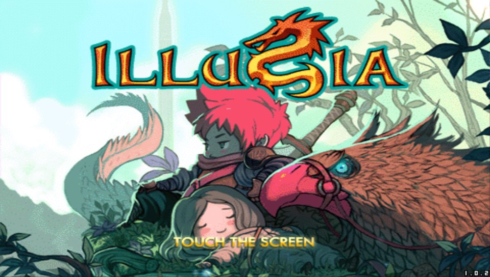

# Illusia Vita

<p align="center"></p>

This is a wrapper/port of <b>Illusia</b> for the *PS Vita*.

The port works by loading the Android ARMv6 executables from the Android release in memory, resolving their imports with native functions and patching it in order to properly run.
By doing so, it's basically as if we emulate a minimalist Android environment in which we run natively the executables as they are.

## Notes

- The loader has been tested with Illusia v1.0.2.
- The title menu is designed for touch only.
- The rest of the game maps the controls to the Vita's controller.
- The game has 8 slots to assign skills and items. Two banks of four each on the left and right hand side of the screen. These skills are mapped to the right-joystick and you can use the R trigger to swap between the active skill bank.
- The game's framerates default to 6, 9, 12, 15, and 18 frame a second. My implementation doubles this, so the speeds are 12, 18, 24, 30, and 36. I find that 24fps is the sweet spot.
- Editing the config.txt file at ux0:/data/destinia/ yields three configuration options:
    - CapFramerate, 0 or 1. This sets the framerate to 30fps.  
    - GraphicsQuality, 0, 1, 2. This sets the graphics quality setting. The game defaults to its lowest setting.

## Controls
- Left Analog: Move
- Directional Pad: Move
- Cross: Attack / Select option in menu
- Circle: Jump (Press twice to Double Jump)
- Triangle: Menu
- Start: Toggle Map
- R Trigger: Toggle Skill Selection
- Right Analog: Use Skills

## Changelog

- Initial Release.

## Setup Instructions (For End Users)

- Install [kubridge](https://github.com/TheOfficialFloW/kubridge/releases/) and [FdFix](https://github.com/TheOfficialFloW/FdFix/releases/) by copying `kubridge.skprx` and `fd_fix.skprx` to your taiHEN plugins folder (usually `ux0:tai`) and adding two entries to your `config.txt` under `*KERNEL`:
  
```
  *KERNEL
  ux0:tai/kubridge.skprx
  ux0:tai/fd_fix.skprx
```

**Note** Don't install fd_fix.skprx if you're using rePatch plugin

- **Optional**: Install [PSVshell](https://github.com/Electry/PSVshell/releases) to overclock your device to 500Mhz.
- Install `libshacccg.suprx`, if you don't have it already, by following [this guide](https://samilops2.gitbook.io/vita-troubleshooting-guide/shader-compiler/extract-libshacccg.suprx).
- Install the vpk from Release tab.
- Obtain your copy of *Illusia v1.02* legally.
- Place the `Assets` and `Res`directories from the APK to `ux0:data/illusia`.
- Extract the files `libgameDSO.so` from the `lib/armeabi/` folder to `ux0:data/illusia`. 

## Build Instructions (For Developers)

In order to build the loader, you'll need a [vitasdk](https://github.com/vitasdk) build fully compiled with softfp usage.  
You can find a precompiled version here: https://github.com/vitasdk/buildscripts/actions/runs/1102643776.  

After all these requirements are met, you can compile the loader with the following commands:

```bash
mkdir build && cd build
cmake .. && make
```

## Credits

- [TheFloW](https://github.com/TheOfficialFlow) for the original .so loader.
- [Rinnegatamante](https://github.com/Rinnegatamante/) for VitaGL and other help with various Vita-related things
- [gl33ntwine](https://github.com/v-atamanenko/) for the awesome Android subsystem reimplementation FalsoNDK and FalsoJNI.
- [Standard-Republic](https://github.com/Rocroverss) for the Livearea assets.